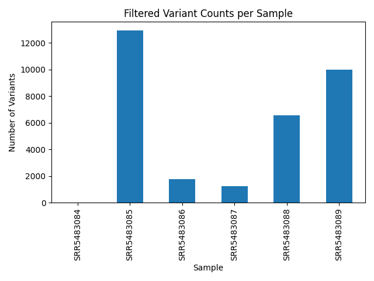

# ctDNA_Fragment_analysis_pipeline

This high-throughput and reproducible pipeline performs end-to-end analysis of cfDNA sequencing data. It includes alignment, fragment size profiling, in silico selection (90–150 bp), variant calling using GATK Mutect2, and visualization.

## ⚙️ Key Features

- Alignment with BWA to GRCh38
- Fragment size extraction from TLEN field
- In silico fragment selection (90–150 bp)
- Variant calling using GATK Mutect2
- Summary statistics and plots
- Workflow managed with **Nextflow**, **SLURM**, and **Singularity**

## 📁 Directory Structure

| Folder                | Description                               |
|-----------------------|-------------------------------------------|
| `aligned_bams/`       | Sorted BAM files from BWA                 |
| `fragments/`          | Raw TLEN fragment sizes                   |
| `fragments_90_150/`   | Size-filtered fragments                   |
| `variants/`           | Unfiltered variant VCFs                   |
| `variants_filtered/`  | Filtered variant VCFs                     |
| `variant_summaries/`  | Per-sample TSV/CSV variant counts         |
| `plots/`              | Visualizations of fragment distributions  |

## 📊 Example Output

### Fragment Size Distribution

<p align="center">
  
</p>

### Variant Summary Table

| Sample ID   | Num Variants |
|-------------|--------------|
| SRR5483084  | 0            |
| SRR5483085  | 12,938       |
| SRR5483086  | 1,773        |
| SRR5483087  | 1,221        |
| SRR5483088  | 6,573        |
| SRR5483089  | 9,984        |

## 🚀 Run the Pipeline

Make sure Singularity and Nextflow are installed.

```bash
nextflow run main.nf -c nextflow.config
